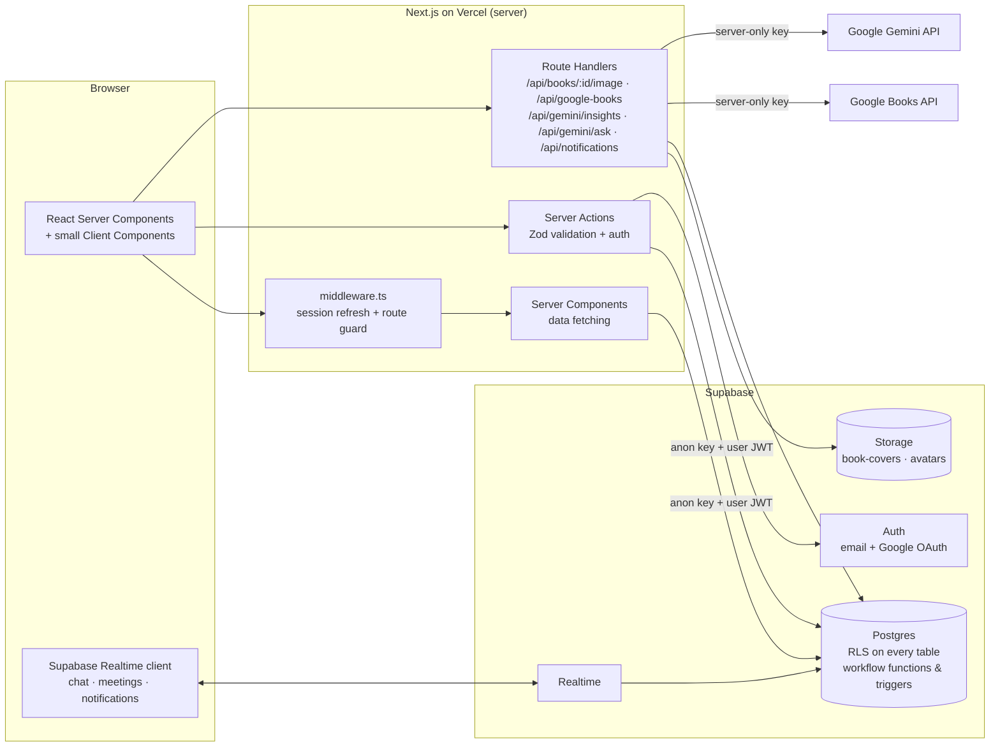
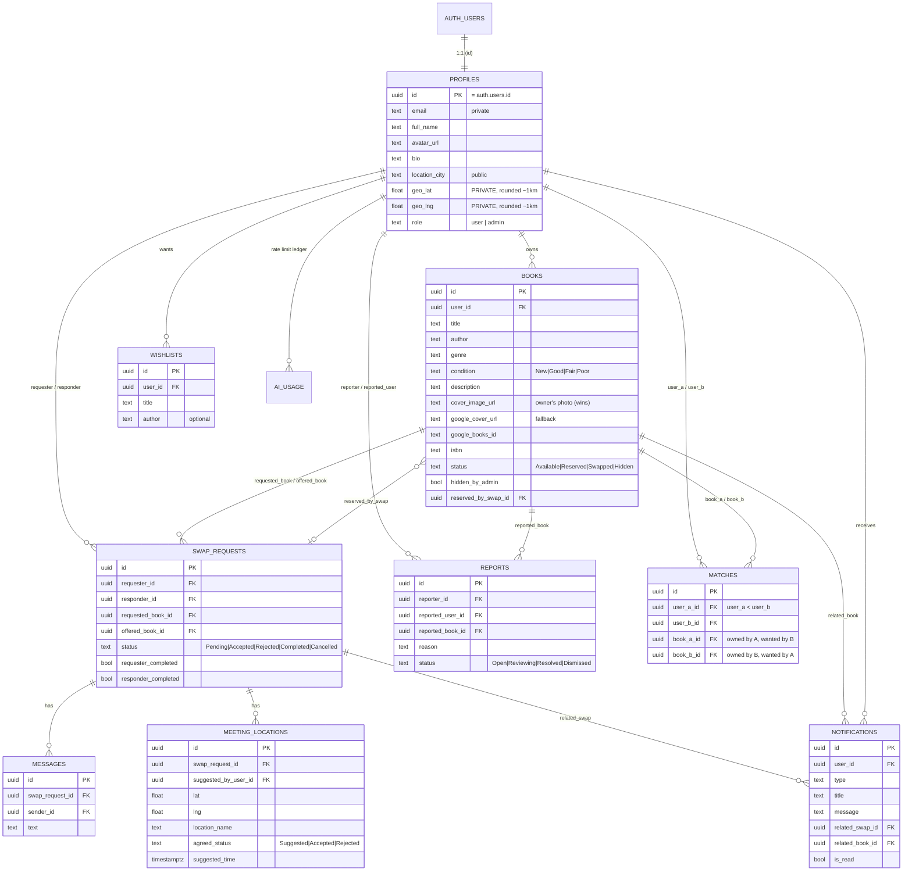
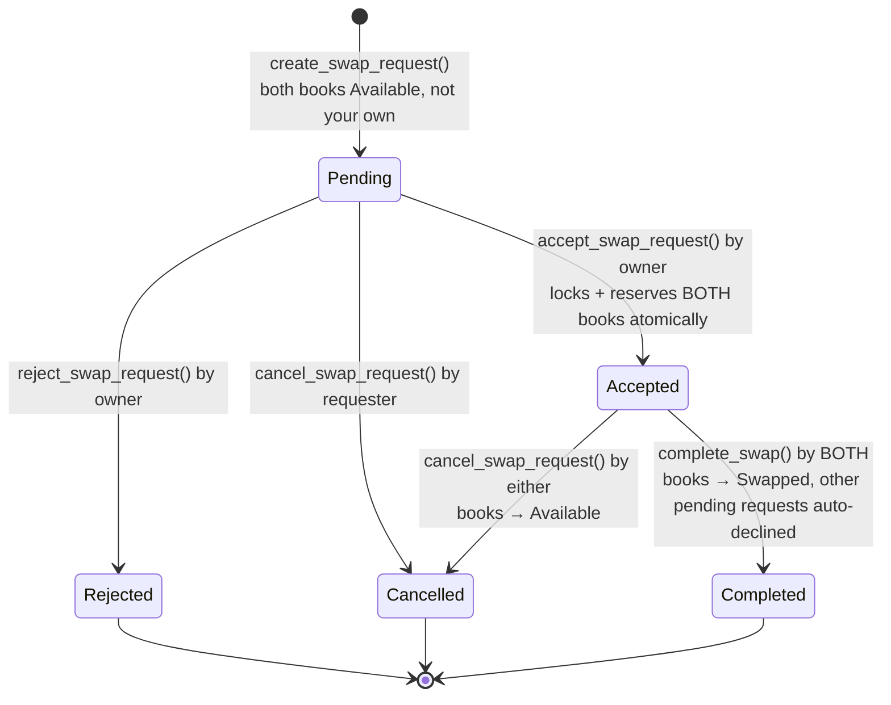

# 📚 BookSwap

**Swap physical books with readers near you.** List the books you've finished (with a photo of _your_ copy), keep a
wishlist, get notified of **mutual matches**, send a swap request, chat in real time, agree on a safe public meeting
spot on a map, and confirm the exchange. Before you commit, ask Google Gemini what the book is like with
**Know Before You Swap**.

> Next.js 15 (App Router) · TypeScript (strict) · Tailwind CSS v4 · shadcn/ui · Supabase (Postgres, Auth, Realtime,
> Storage, RLS) · Google Books API · Google Gemini · Leaflet · Vitest · Playwright

---

## Contents

1. [Features](#features)
2. [Architecture](#architecture)
3. [Database & ER diagram](#database)
4. [Matching algorithm](#matching-algorithm)
5. [Swap lifecycle](#swap-lifecycle)
6. [Authentication](#authentication)
7. [APIs & integrations](#apis--integrations)
8. [Security checklist](#security-checklist)
9. [Getting started (local)](#getting-started-local)
10. [Environment variables](#environment-variables)
11. [Testing](#testing)
12. [Deployment (Supabase + Vercel)](#deployment-supabase--vercel)
13. [Project structure](#project-structure)
14. [Verification status & known limitations](#verification-status--known-limitations)

---

## Features

| Area                          | What you get                                                                                                                                                                                                                                                 |
| ----------------------------- | ------------------------------------------------------------------------------------------------------------------------------------------------------------------------------------------------------------------------------------------------------------ |
| **Accounts**                  | Email/password sign-up & login, Google OAuth, logout, protected routes (middleware + server checks + RLS)                                                                                                                                                    |
| **Profile**                   | Name, bio, city, avatar upload, _approximate_ location picked on a map (stored at ~1 km precision, never shown)                                                                                                                                              |
| **Listings**                  | Google Books autocomplete (title/author/ISBN) fills the form; everything stays editable; **photo of the physical copy** via file picker, drag & drop or phone camera, with preview, replace, remove and real upload progress; soft-delete (hide) and re-list |
| **Discover**                  | Search (title/author/genre), filters (genre, condition, distance, availability), sorting, pagination; cards show photo, condition, owner, distance, wishlist ♥, AI insights, swap request and a mutual-match ribbon                                          |
| **Wishlist**                  | Add/remove/search; normalised de-duplication; drives matching                                                                                                                                                                                                |
| **Mutual matches**            | Computed inside Postgres with indexed joins; both users are notified the moment a match appears                                                                                                                                                              |
| **Swaps**                     | Request → accept/reject/cancel → both confirm → completed. Accepting **atomically reserves both books** with row locks                                                                                                                                       |
| **Swap workspace**            | Realtime chat (Supabase Realtime) + Leaflet meeting map side-by-side on desktop, tabbed on mobile                                                                                                                                                            |
| **Meetings**                  | Drop a pin, name the place, propose a time; the other participant accepts/declines; public-place safety guidance                                                                                                                                             |
| **Notifications**             | Bell with live unread count + dropdown, full page, mark one / all as read — for requests, accepts, rejections, matches, messages, meetings and completions                                                                                                   |
| **AI — Know Before You Swap** | Server-side Gemini: 3-bullet summary, tone & vibes, audience, similar reads, streaming Q&A with quick prompts, explicit confidence level, rate-limited per user                                                                                              |
| **Moderation**                | Report books/users; `/admin` (role-gated on the server and in Postgres) to review, hide/restore books, review users, resolve/dismiss reports                                                                                                                 |
| **Polish**                    | Warm editorial design (amber, terracotta, cream, slate, forest), Framer Motion with `prefers-reduced-motion`, dark mode tokens, accessible forms/dialogs, empty/loading/error states everywhere                                                              |

---

## Architecture



**Principles**

- **Server Components by default.** Client Components are only used for interactivity (forms, chat, map, sheets).
- **Every query runs as the signed-in user** (anon key + their JWT), so Postgres Row Level Security is the final
  authority. The service-role key is _not_ used by the running app.
- **Business rules live in the database** where they must be atomic: `create_swap_request`, `accept_swap_request`,
  `reject_swap_request`, `cancel_swap_request`, `complete_swap`, `respond_meeting_location`, matching triggers.
  The TypeScript mirrors in `lib/books/status.ts`, `lib/swaps/status.ts`, `lib/matching` exist for UI decisions and
  tests.
- **One naming convention end-to-end:** snake_case columns, capitalised status values (`'Available'`, `'Pending'`)
  identical in SQL `CHECK` constraints, `types/database.ts`, Zod schemas and UI.

---

## Database

All schema lives in versioned, idempotent migrations in [`supabase/migrations`](supabase/migrations):

| Migration                  | Contents                                                                                                               |
| -------------------------- | ---------------------------------------------------------------------------------------------------------------------- |
| `0100_foundation`          | helpers (`set_updated_at`, `normalize_text`), `profiles`, `is_admin()`, auth → profile trigger, `public_profiles` view |
| `0200_books_wishlists`     | `books` (+ status-transition guard trigger), `wishlists`, trigram & matching indexes, RLS                              |
| `0300_notifications`       | `notifications`, internal `create_notification()`                                                                      |
| `0400_swaps`               | `swap_requests`, `messages`, `meeting_locations`, workflow functions, RLS                                              |
| `0500_matching_discovery`  | `matches`, matching functions/triggers, `get_my_matches()`, `discover_books()`, distance helpers                       |
| `0600_moderation`          | `reports`, admin functions                                                                                             |
| `0700_storage_realtime_ai` | storage buckets & policies, realtime publication, `ai_usage` + `consume_ai_quota()`                                    |

### ER diagram



**Key constraints:** status `CHECK`s; `books_reservation_consistent` (`status = 'Reserved'` ⇔ `reserved_by_swap_id`
set); `wishlists_unique_item (user_id, title_norm, author_norm)`; one active swap per book pair
(`swap_requests_one_active_per_pair`, direction-independent); one open report per reporter/target; `matches_unique_pair`;
`on delete restrict` from swaps to books so history can never be orphaned (books are soft-deleted via `Hidden`).

**Indexes** cover every column from the brief (`books.user_id/status/genre/title/author`, `wishlists.user_id`,
`swap_requests.requester_id/responder_id/status`, `messages.swap_request_id/created_at`, `notifications.user_id/is_read`,
`reports.status`) plus trigram GIN indexes for search, partial indexes for matching (`title_norm, author_norm WHERE
status IN ('Available','Reserved')`) and unread notifications.

---

## Matching algorithm

A **mutual match** exists when user A lists book X that user B wishes for **and** user B lists book Y that user A
wishes for.

1. Titles and authors are normalised in Postgres (`normalize_text`: lower-case, punctuation stripped, whitespace
   collapsed) into **generated, indexed columns** on both `books` and `wishlists`.
2. A wishlist item matches a book when `title_norm` is equal and either the wishlist author is blank or
   `author_norm` is equal. (No fuzzy/substring matching — predictable, index-friendly.)
3. `compute_mutual_matches(user)` runs two indexed joins — _"who wants my live books?"_ and _"whose live books do I
   want?"_ — and intersects them on the other user. Nothing is ever loaded into JavaScript.
4. Triggers on `books` (insert, title/author/status change) and `wishlists` (insert/delete) call
   `refresh_matches_for_user`, which upserts the canonical row (`user_a_id < user_b_id`, unique per book pair),
   removes matches that became invalid (item removed, book hidden/swapped/edited), and **notifies both users once**.
5. `get_my_matches()` returns each match from the caller's perspective with the other reader's public profile,
   approximate distance, both books' statuses and a derived `match_status` (`Open`, `Pending`, `Accepted`,
   `Unavailable`) plus the active swap id if one exists.

Guarantees: no self-matches, no duplicates, hidden/swapped books excluded, reserved books kept (they may become
available again). The same rules are implemented in `lib/matching` and unit-tested.

---

## Swap lifecycle



Book status machine (enforced by the `books_guard_update` trigger; reservation states can only be set by the
workflow functions):

```
Available → Reserved | Hidden      Reserved → Available | Swapped      Hidden → Available      Swapped → (terminal)
```

**Concurrency.** `accept_swap_request` locks the swap row, then both book rows `FOR UPDATE` in id order (no
deadlocks), re-checks availability and ownership on the locked rows, reserves both books, flips the swap to
`Accepted` and writes notifications — all inside one function call, i.e. one transaction. A concurrent accept that
touches either book blocks on the lock and then fails the availability check; nothing is partially updated. This is
proven by a real two-session race in `tests/db/run.sh`.

**History is preserved.** Completed swaps, their messages, meeting points and notifications are never deleted;
swapped books remain visible to the two participants. The owner can **"List a copy again"**, which creates a new
listing rather than resurrecting history.

---

## Authentication

- Supabase Auth with **email/password** and **Google OAuth** (PKCE). `auth.users` is the identity source; the
  `on_auth_user_created` trigger creates the matching `profiles` row (name/avatar from OAuth metadata).
- `@supabase/ssr` stores the session in HTTP-only cookies. `middleware.ts` refreshes it on every navigation and
  redirects signed-out visitors away from app routes (`/dashboard`, `/discover`, `/books`, `/wishlist`, `/matches`,
  `/swaps`, `/profile`, `/notifications`, `/admin`). Book detail pages (`/books/:id`) are public.
- Middleware is only a convenience: **every layout, page, server action and route handler calls
  `supabase.auth.getUser()`** (which re-validates the JWT with Supabase), and RLS enforces access in the database.
- `/callback` handles both OAuth codes and email-confirmation `token_hash` links; `?next=` redirects are restricted to
  same-origin paths (`safeNextPath`).
- Admin = `profiles.role = 'admin'`, checked in `app/admin/layout.tsx`, in each admin server action
  (`requireAdmin()`), and again inside every admin SQL function (`is_admin()`). Users cannot change their own role
  (column-level privileges).

---

## APIs & integrations

| Integration      | Where                                                                                   | Notes                                                                                                                                                                                                                                                                                                                                                                                                       |
| ---------------- | --------------------------------------------------------------------------------------- | ----------------------------------------------------------------------------------------------------------------------------------------------------------------------------------------------------------------------------------------------------------------------------------------------------------------------------------------------------------------------------------------------------------- |
| **Google Books** | `lib/google-books`, `GET /api/google-books?q=`                                          | Server-side proxy (optional key stays server-only), ISBN detection, HTML-stripped descriptions, https thumbnails, 24 h fetch cache. Metadata only fills text fields and `google_cover_url` — never the owner's photo.                                                                                                                                                                                       |
| **Gemini**       | `lib/gemini`, `POST /api/gemini/insights`, `POST /api/gemini/ask`                       | REST client, key sent as a header from the server only. Insights use JSON mode + a response schema, validated with Zod, cached per title/author for 7 days. Q&A streams plain text via SSE → `ReadableStream`. System prompt forbids invented facts, requires a confidence level and treats user-written descriptions as untrusted. Per-user limit: 30 requests/hour (`consume_ai_quota`, advisory-locked). |
| **Storage**      | `POST/DELETE /api/books/:id/image`, `POST /api/profile/avatar`                          | Server validates extension + declared MIME + **magic bytes** + size (4 MB); images are downscaled to WebP in the browser first. Paths `book-covers/{user_id}/{book_id}/{uuid}.{ext}`; storage RLS pins writes to the owner's folder _and_ to a book they own. Replaced/removed images are deleted.                                                                                                          |
| **Realtime**     | `hooks/use-chat.ts`, `use-meetings.ts`, `use-notifications.ts`, `swap-live-refresh.tsx` | `postgres_changes` subscriptions; Realtime applies each table's RLS per subscriber, so users only receive their own swap's messages and their own notifications.                                                                                                                                                                                                                                            |
| **Maps**         | `components/map/*`                                                                      | Leaflet + OpenStreetMap tiles, loaded client-side only (`next/dynamic`, `ssr: false`), custom SVG markers.                                                                                                                                                                                                                                                                                                  |

---

## Security checklist

- [x] **RLS enabled on every table** with explicit policies; writes to swaps/notifications/matches only through
      SECURITY DEFINER functions that check `auth.uid()`; all definer functions pin `search_path = ''`.
- [x] **Column-level privileges**: users can't set `role`, `email`, `status` of swaps, `hidden_by_admin`,
      `reserved_by_swap_id`, notification text, report status, etc.
- [x] **Private coordinates**: `profiles` rows are readable only by their owner/admins; others use `public_profiles`
      (no email/coords/role). Coordinates are rounded to ~1 km on write; only whole-km distances (min 1 km) leave the DB.
- [x] **Meeting coordinates** visible only to the two swap participants.
- [x] **Chat** readable/writable only by participants of an active swap, as themselves (`sender_id = auth.uid()`).
- [x] **Storage policies**: owner-folder + owned-book checks; public read only for listing images/avatars.
- [x] **File validation on the server** (magic bytes, not MIME alone), size limits in the route _and_ the bucket.
- [x] **Secrets**: `GEMINI_API_KEY`, `GOOGLE_BOOKS_API_KEY` and `SUPABASE_SERVICE_ROLE_KEY` are read only in
      `lib/env.server.ts` (`import "server-only"`); nothing secret uses the `NEXT_PUBLIC_` prefix. The app never uses
      the service-role key at runtime.
- [x] **Input validation**: Zod on every server action and route handler (client validation is UX only).
- [x] **SQL injection**: no string-built SQL; PostgREST parameterises; PL/pgSQL uses parameters/`format(%L)`.
- [x] **XSS**: React escaping everywhere, no `dangerouslySetInnerHTML`; Google descriptions are stripped to text;
      URLs constrained to `https://` by CHECK constraints and Zod.
- [x] **CSRF**: Server Actions have built-in origin checks; mutating route handlers verify `Origin` vs `Host`;
      auth cookies are `SameSite=Lax`.
- [x] **Open redirects**: `safeNextPath` on every `next` parameter.
- [x] **Admin**: server-side role checks + `is_admin()` inside SQL; admin UI hiding is cosmetic only.
- [x] **Security headers**: `X-Frame-Options: DENY`, `nosniff`, `Referrer-Policy`, `Permissions-Policy`.
- [x] **Abuse limits**: AI rate limit, one open report per target, duplicate-request prevention.

---

## Getting started (local)

Prerequisites: Node ≥ 20.9, npm, Docker (for the Supabase CLI local stack).

```bash
npm install

# 1. Start Supabase locally (Postgres, Auth, Storage, Realtime, Studio)
npx supabase start
npx supabase db reset          # applies supabase/migrations/* then supabase/seed.sql

# 2. Configure env
cp .env.example .env.local
#   NEXT_PUBLIC_SUPABASE_URL      = API URL from `npx supabase status`
#   NEXT_PUBLIC_SUPABASE_ANON_KEY = anon key from `npx supabase status`
#   GEMINI_API_KEY                = from https://aistudio.google.com/apikey

# 3. Run
npm run dev    # http://localhost:3000
```

**Seed accounts** (password `BookSwap#2026`): `alice@bookswap.test` and `bob@bookswap.test` (already a mutual match:
Pride and Prejudice ⇄ The Hobbit), `carol@bookswap.test`, and moderator `admin@bookswap.test`.

To make any user an admin: `update public.profiles set role = 'admin' where email = 'you@example.com';`

---

## Environment variables

| Variable                        | Public?                          | Required                         | Where to get it                                         | Used in                                            |
| ------------------------------- | -------------------------------- | -------------------------------- | ------------------------------------------------------- | -------------------------------------------------- |
| `NEXT_PUBLIC_SUPABASE_URL`      | ✅ public                        | yes                              | Supabase → Project Settings → API                       | all Supabase clients, `next.config.ts` image hosts |
| `NEXT_PUBLIC_SUPABASE_ANON_KEY` | ✅ public (RLS-protected)        | yes                              | Supabase → Project Settings → API                       | all Supabase clients                               |
| `NEXT_PUBLIC_SITE_URL`          | ✅ public                        | recommended in prod              | your domain, e.g. `https://bookswap.vercel.app`         | auth redirect URLs, metadata                       |
| `GEMINI_API_KEY`                | 🔒 server-only                   | for AI features                  | [Google AI Studio](https://aistudio.google.com/apikey)  | `lib/gemini`                                       |
| `GEMINI_MODEL`                  | 🔒 server-only                   | no (default `gemini-2.5-flash`)  | —                                                       | `lib/gemini`                                       |
| `GOOGLE_BOOKS_API_KEY`          | 🔒 server-only                   | no (works keyless at low volume) | Google Cloud Console → Credentials (enable _Books API_) | `lib/google-books`                                 |
| `SUPABASE_SERVICE_ROLE_KEY`     | 🔒 server-only, **bypasses RLS** | no — not used by the app         | Supabase → Project Settings → API                       | reserved for maintenance/E2E setup only            |

`lib/env.ts` validates public variables; `lib/env.server.ts` validates server variables. A missing variable produces a
`MissingEnvError` that names the variable (never its value) only when the feature that needs it is used — e.g. a
missing Gemini key returns _"This feature isn't configured on the server yet"_ from the AI endpoints while the rest
of the app keeps working.

---

## Testing

| Command             | What it runs                                                                                                                                                                                                                                                                                                         |
| ------------------- | -------------------------------------------------------------------------------------------------------------------------------------------------------------------------------------------------------------------------------------------------------------------------------------------------------------------- |
| `npm run lint`      | ESLint (next/core-web-vitals + typescript, `no-explicit-any` as error)                                                                                                                                                                                                                                               |
| `npm run typecheck` | `tsc --noEmit` in strict mode (`noUncheckedIndexedAccess` on)                                                                                                                                                                                                                                                        |
| `npm test`          | Vitest: unit tests (validation, matching, both state machines, utils, image sniffing, Google Books mapping, Gemini prompts) + React Testing Library component tests; Supabase integration suite when `SUPABASE_TEST_*` is set                                                                                        |
| `npm run test:db`   | Applies all migrations **twice** to a throw-away Postgres (with a small Supabase shim), seeds, then runs ~70 SQL assertions for RLS, storage policies, state machines, matching, swaps, chat/meeting authorisation, notifications, moderation, AI quota, plus a **real concurrent-accept race** between two sessions |
| `npm run test:e2e`  | Playwright: the complete two-user journey (register → list with photo → wishlist → match → request → accept → reserved → realtime chat → meeting → accept → complete → swapped → notifications), plus mobile smoke tests                                                                                             |

`test:db` needs `PGHOST/PGPORT/PGUSER` for a Postgres 15+ server where you can create databases (e.g.
`docker run -p 5432:5432 -e POSTGRES_PASSWORD=postgres postgres:16`). CI runs it automatically
(`.github/workflows/ci.yml`).

---

## Deployment (Supabase + Vercel)

1. **Create a Supabase project** at [supabase.com](https://supabase.com). Note the project URL and anon key.
2. **Run the migrations** (creates tables, RLS, functions, triggers, storage buckets & policies, realtime publication):
   ```bash
   npx supabase login
   npx supabase link --project-ref <your-project-ref>
   npx supabase db push            # applies supabase/migrations/*
   # optional demo data: psql "$DATABASE_URL" -f supabase/seed.sql
   ```
3. **Configure Auth** (Authentication → URL Configuration): Site URL `https://<your-domain>`; Redirect URLs
   `https://<your-domain>/callback` and, for previews, `https://*-<your-team>.vercel.app/callback`.
   Decide whether email confirmation is on (Authentication → Providers → Email). With it on, users confirm via the
   emailed link, which lands on `/callback`.
4. **Configure Google OAuth**: in Google Cloud Console create an OAuth client (Web). Authorised redirect URI:
   `https://<project-ref>.supabase.co/auth/v1/callback`. Paste the client id/secret into Supabase → Authentication →
   Providers → Google and enable it.
5. **Storage buckets** are created by migration `0700` (`book-covers`, `avatars`) — nothing to click.
6. **Deploy to Vercel**: import the GitHub repo in Vercel (framework preset: Next.js). Add the environment variables
   from the table above for Production (and Preview). `NEXT_PUBLIC_SITE_URL` = your production URL.
7. **Redeploy** after setting env vars, then **add the Vercel domain** to Supabase redirect URLs (step 3) if you
   haven't yet.
8. **Smoke-test production**: register, list a book with a photo, open it in a private window (public page), sign in
   with Google, and run through a swap with a second account. `E2E_BASE_URL=https://<your-domain> npm run test:e2e`
   runs the automated journey against the deployment.

### Pushing to GitHub

```bash
git remote add origin https://github.com/<you>/<repo>.git
git push -u origin main
```

---

## Project structure

```text
app/
  (auth)/login · register · callback        auth pages + OAuth/email callback
  (dashboard)/dashboard · discover · books(/new, /[id]/edit) · wishlist · matches · swaps(/[id]) · profile · notifications
  books/[id]/                               public book details
  admin/ · admin/users/[id]                 moderation (role-gated)
  api/books/[id]/image · api/google-books · api/gemini/{insights,ask} · api/notifications · api/profile/avatar
actions/            server actions (auth, profile, books, wishlist, swaps, messages, meetings, notifications, reports, admin)
components/         ui (shadcn) · layout · auth · books · wishlist · matches · swaps · chat · map · notifications · profile · admin
hooks/              use-chat · use-meetings · use-notifications · use-debounced-value
lib/                env · supabase (browser/server/middleware) · auth · validations (Zod) · matching · books/swaps status
                    machines · google-books · gemini · images (validate/compress/upload) · utils
types/              database.ts (DB types, single source of truth) · index.ts (domain types)
supabase/           migrations/ · seed.sql · config.toml
tests/              unit/ · integration/ · db/ (SQL suite + runner) · e2e/ (Playwright)
```

---

## Verification status & known limitations

**What was executed while building this repository**

- ✅ **Database layer — verified.** All migrations were applied (twice, proving idempotency) to PostgreSQL 16 with the
  Supabase shim, the seed loaded, and the SQL suite passed: 70 assertions + the concurrent-reservation race
  (`npm run test:db`).
- ✅ **Application — lint, typecheck, unit/component tests and production build verified** (Node 22, clean `npm ci`):
  `npm run lint`, `npm run typecheck`, `npm test` (108 passed; the Supabase integration suite skips without
  `SUPABASE_TEST_*`) and `npm run build` all pass. CI (`.github/workflows/ci.yml`) runs these on every push.
- ⚠️ **Playwright E2E — not yet run.** It needs a running Supabase stack (`npx supabase start`) and
  `SUPABASE_SERVICE_ROLE_KEY`.
- ⚠️ **Live integrations — not verified.** No Supabase project, Google OAuth client or Gemini key was available, so
  OAuth, Storage uploads, Realtime delivery and Gemini responses have not been exercised against the real services.

**Known limitations / trade-offs**

- Title matching is exact after normalisation (no fuzzy matching or edition grouping). A trigram-based "did you
  mean" could be added using the existing `pg_trgm` indexes.
- Push notifications are not implemented (in-app + realtime only).
- Distances are straight-line, whole-kilometre approximations by design (privacy).
- Map tiles come from the public OpenStreetMap tile server; for heavy production traffic use a tile provider that
  permits it.
- AI insights are cached per title/author for 7 days in the Next.js data cache; "Regenerate" bypasses the cache.
